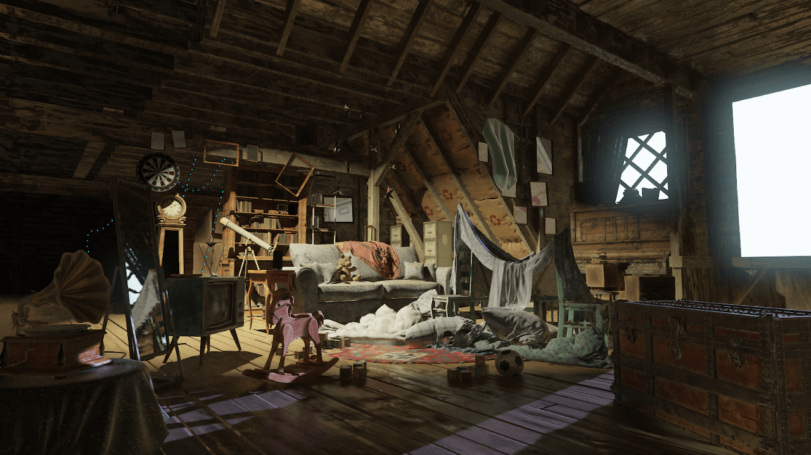

# NVIDIA USD Attic Sample (HARFANG 3D Format)

 [NVIDIA USD Attic Sample](https://developer.nvidia.com/usd), in HARFANG 3D format.


_The NVIDIA USD Attic in HARFANG Studio, using the AAA renderer._

## Overview

This repository contains the work done to convert the NVIDIA USD Attic Sample scene to HARFANG 3D format, using the [USD Importer](https://github.com/harfang3d/usd-importer). The goal of this project was to demonstrate the power of the USD Importer and HARFANG 3D tools in managing and converting complex 3D scenes.

## Conversion Process

The conversion process was completed through the following steps:

1. **Scene Import**: The NVIDIA USD Attic Sample scene was imported using the USD Importer tool in the command line. The command used was:
    ```bash
    USD_Importer.exe Attic_NVIDIA_725\Attic_NVIDIA\Attic_NVIDIA.usd -o resources\attic -base-resource-path resources
    ```
2. **Lighting and Materials Adjustments**: After importing the scene, lighting and materials were adjusted and enhanced in the [Harfang Studio](https://www.harfang3d.com/en_US/studio) to optimize the scene's appearance and performance.

## License

The original [NVIDIA USD Attic Sample scene](https://developer.nvidia.com/usd) and its HARFANG derivative are licensed under Attribution 4.0 International (CC BY 4.0).

## Acknowledgements

We thank NVIDIA for providing the original Attic Sample scene, which made this project possible.

